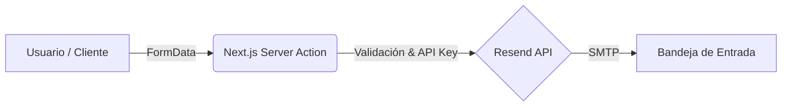

# 🚀 Fullstack Portfolio | Facundo Ortiz


Este es mi portfolio personal, diseñado con un enfoque minimalista y sobrio, pero con una identidad visual fuerte basada en efectos de neón dinámicos. El objetivo principal de este proyecto es demostrar habilidades sólidas en el ecosistema moderno de React, priorizando el rendimiento, la accesibilidad y la arquitectura backend.

## ✨ Características Principales

- **Arquitectura Moderna:** Construido sobre Next.js 16 (App Router) aprovechando Server Components para un SEO óptimo.
- **UI/UX Refinada:** - Sistema de diseño basado en **shadcn/ui** y **Radix UI**.
  - Modo claro y oscuro con transiciones fluidas mediante `next-themes`.
  - Efectos de iluminación de silueta y parpadeo de neón mediante filtros de CSS avanzados y **Framer Motion**.
- **Gestión de Contacto:** Lógica de envío de correos integrada mediante **Server Actions** y la API de **Resend**, eliminando la necesidad de APIs externas pesadas.
- **Responsive & Accesible:** Totalmente adaptado a dispositivos móviles y cumpliendo estándares de accesibilidad (a11y).

## 🛠️ Stack Tecnológico

| Capa | Tecnología |
| :--- | :--- |
| **Frontend** | [Next.js 16](https://nextjs.org/), [React 19](https://react.dev/), [TypeScript](https://www.typescriptlang.org/) |
| **Estilos** | [Tailwind CSS 4](https://tailwindcss.com/), [Framer Motion 12](https://www.framer.com/motion/), Lucide Icons |
| **Componentes** | [shadcn/ui](https://ui.shadcn.com/) (Radix UI) |
| **Backend** | Next.js Server Actions, [Resend SDK](https://resend.com/) |

## 📐 Flujo de Contacto (Backend Logic)



## 📦 Instalación y Configuración

1. Clonar el repositorio:
   ```bash
   git clone [https://github.com/AFacundoOrtiz/portfolio.git](https://github.com/AFacundoOrtiz/portfolio.git)
   ```

2. Instalar dependencias:
   ```bash
   npm install
   ```

3. Configurar variables de entorno: Crea un archivo .env en la raíz y añade tu API Key de Resend:
   ```env
   RESEND_API_KEY=re_tu_api_key_aqui
   ```

4. Ejecutar servidor de desarrollo:
   ```bash
   npm run dev
   ```

## 🚀 Scripts Disponibles

En el directorio del proyecto, puedes ejecutar los siguientes comandos:

| Comando | Acción |
| :--- | :--- |
| `npm run dev` | Inicia el servidor de desarrollo con Hot Module Replacement (HMR). |
| `npm run build` | Compila la aplicación para producción optimizando assets y Server Components. |
| `npm run start` | Arranca el servidor en modo producción (requiere build previa). |
| `npm run lint` | Ejecuta ESLint para asegurar la consistencia y calidad del código. |

---

<div align="center">
  <p>Diseñado y desarrollado por <b>Facundo Ortiz</b></p>
  <a href="https://www.linkedin.com/in/facundo-ortiz-8a24b42a2/">LinkedIn</a> • 
  <a href="https://github.com/AFacundoOrtiz">GitHub</a>
</div>